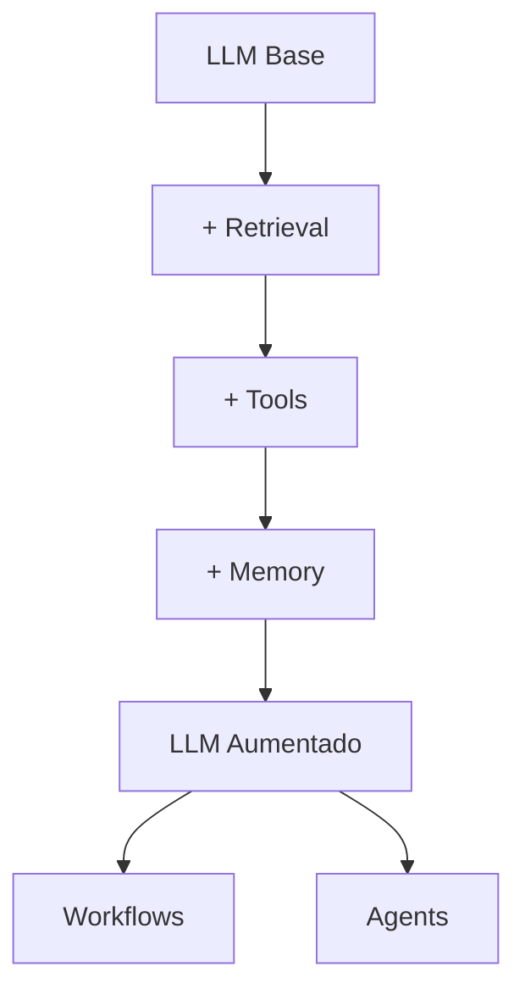

# Guía Completa: Construcción de Agentes Efectivos con Claude (Anthropic)

**TL;DR**: Guía completa basada en la documentación oficial de Anthropic para construir agentes IA efectivos usando patrones simples y composables, priorizando simplicidad sobre complejidad y midiendo performance antes de agregar funcionalidades.

## Investigación Realizada
- Análisis completo de la documentación oficial de Anthropic sobre construcción de agentes
- Revisión de mejores prácticas y patrones recomendados
- Investigación de implementaciones en el ecosistema 2024-2025

---

## 1. Fundamentos: ¿Qué son los Agentes?

### Definición y Taxonomía

Anthropic categoriza los sistemas agnóticos en dos tipos principales:

#### **Workflows (Flujos de Trabajo)**
- Sistemas donde LLMs y herramientas son orquestados mediante código predefinido
- Rutas de ejecución determinísticas
- Mayor predictibilidad y control

#### **Agents (Agentes)**
- Sistemas donde LLMs dirigen dinámicamente sus propios procesos
- Control autónomo sobre el uso de herramientas
- Mayor flexibilidad y toma de decisiones dirigida por el modelo

---

## 2. Principios de Decisión: Cuándo y Cuándo NO usar Agentes

### 🚦 Regla de Oro: Simplicidad Primero

**Prioridades en orden:**
1. **Prompts simples optimizados** con retrieval y ejemplos en contexto
2. **Workflows predefinidos** para tareas bien estructuradas
3. **Agentes autónomos** solo cuando se necesite flexibilidad y decisiones complejas

### ⚖️ Trade-offs Fundamentales

**Agentes intercambian:**
- ❌ Mayor latencia y costo
- ❌ Menor predictibilidad
- ✅ Mejor rendimiento en tareas complejas
- ✅ Flexibilidad y adaptabilidad

### 🎯 Cuándo SÍ usar Agentes

- Problemas abiertos donde es difícil predecir el número de pasos
- Tareas que requieren toma de decisiones dinámicas
- Necesidad de escalabilidad en ambientes confiables
- Criterios de éxito claros y medibles

### 🚫 Cuándo NO usar Agentes

- Tareas que pueden resolverse con prompts optimizados
- Flujos de trabajo completamente predecibles
- Presupuestos limitados de latencia/costo
- Requisitos de máxima predictibilidad

---

## 3. Building Block Fundamental: LLM Aumentado

### Componentes Esenciales



### Implementación Recomendada

```typescript
// Ejemplo usando Model Context Protocol (MCP)
interface AugmentedLLM {
  model: AnthropicModel;
  retrieval: RetrievalSystem;
  tools: ToolRegistry;
  memory: ConversationMemory;
}

class ClaudeAgent {
  constructor(
    private llm: AugmentedLLM,
    private config: AgentConfig
  ) {}
  
  async process(input: string): Promise<AgentResponse> {
    // Implementación del loop principal
    const context = await this.prepareContext(input);
    const response = await this.llm.generate(context);
    return this.processResponse(response);
  }
}
```

---

## 4. Patrones de Workflows

### 4.1 Prompt Chaining (Encadenamiento de Prompts)

**Concepto**: Descomponer una tarea en secuencia de pasos donde cada llamada LLM procesa la salida de la anterior.

```typescript
// Ejemplo: Generación de marketing copy + traducción
async function marketingCopyWorkflow(brief: string, language: string) {
  // Paso 1: Generar copy en inglés
  const englishCopy = await claude.generate({
    prompt: `Create marketing copy for: ${brief}`,
    max_tokens: 500
  });
  
  // Gate: Validar que el copy cumple criterios
  if (!validateCopy(englishCopy)) {
    throw new Error("Copy doesn't meet criteria");
  }
  
  // Paso 2: Traducir a idioma objetivo
  const translatedCopy = await claude.generate({
    prompt: `Translate this marketing copy to ${language}: ${englishCopy}`,
    max_tokens: 500
  });
  
  return translatedCopy;
}
```

**Cuándo usar**: Tareas que se pueden descomponer claramente en subtareas fijas.

**Ventajas**: 
- Mayor precisión por simplificación de cada llamada
- Control granular con gates de validación
- Fácil debugging

### 4.2 Routing (Enrutamiento)

**Concepto**: Clasificar input y dirigirlo a tareas especializadas.

```typescript
interface RouteConfig {
  classifier: (input: string) => Promise<string>;
  handlers: Record<string, (input: string) => Promise<string>>;
}

class RoutingWorkflow {
  constructor(private config: RouteConfig) {}
  
  async process(input: string): Promise<string> {
    const route = await this.config.classifier(input);
    const handler = this.config.handlers[route];
    
    if (!handler) {
      throw new Error(`No handler for route: ${route}`);
    }
    
    return handler(input);
  }
}

// Ejemplo: Sistema de soporte al cliente
const customerSupportRouter = new RoutingWorkflow({
  classifier: async (query) => {
    const response = await claude.generate({
      prompt: `Classify this customer query: ${query}
      Categories: refund, technical, general, billing
      Return only the category name.`
    });
    return response.trim();
  },
  handlers: {
    refund: handleRefundRequest,
    technical: handleTechnicalSupport,
    general: handleGeneralInquiry,
    billing: handleBillingQuestion
  }
});
```

**Cuándo usar**: Tareas complejas con categorías distintas que se manejan mejor por separado.

### 4.3 Parallelization (Paralelización)

**Concepto**: Ejecutar tareas simultáneamente y agregar resultados programáticamente.

#### Variante A: Sectioning (Secciones)

```typescript
async function parallelAnalysis(codebase: string[]) {
  const analyses = await Promise.all([
    analyzeCodeSecurity(codebase),
    analyzeCodePerformance(codebase),
    analyzeCodeMaintainability(codebase)
  ]);
  
  return aggregateAnalyses(analyses);
}
```

#### Variante B: Voting (Votación)

```typescript
async function multipleReviewVoting(code: string, threshold: number = 2) {
  const reviews = await Promise.all([
    reviewCodeSecurity(code),
    reviewCodeBestPractices(code),
    reviewCodeLogic(code)
  ]);
  
  const flagged = reviews.filter(r => r.hasIssues);
  return flagged.length >= threshold;
}
```

**Cuándo usar**: Cuando las subtareas pueden paralelizarse o se necesitan múltiples perspectivas.

### 4.4 Orchestrator-Workers (Orquestador-Trabajadores)

**Concepto**: LLM central descompone dinámicamente tareas y delega a workers especializados.

```typescript
class OrchestratorWorkflow {
  constructor(
    private orchestrator: AnthropicModel,
    private workers: Record<string, Worker>
  ) {}
  
  async process(task: string): Promise<any> {
    // El orquestador planifica dinámicamente
    const plan = await this.orchestrator.generate({
      prompt: `Break down this task into subtasks: ${task}
      Available workers: ${Object.keys(this.workers).join(', ')}
      Return JSON with subtasks and assigned workers.`
    });
    
    const subtasks = JSON.parse(plan);
    const results = [];
    
    for (const subtask of subtasks) {
      const worker = this.workers[subtask.worker];
      const result = await worker.execute(subtask.task);
      results.push(result);
    }
    
    // Síntesis final
    return this.orchestrator.generate({
      prompt: `Synthesize these results: ${JSON.stringify(results)}
      Original task: ${task}`
    });
  }
}
```

**Cuándo usar**: Tareas complejas donde no se pueden predecir las subtareas necesarias.

### 4.5 Evaluator-Optimizer (Evaluador-Optimizador)

**Concepto**: Un LLM genera respuesta mientras otro evalúa y proporciona feedback en loop.

```typescript
class EvaluatorOptimizer {
  constructor(
    private generator: AnthropicModel,
    private evaluator: AnthropicModel,
    private maxIterations: number = 3
  ) {}
  
  async optimize(task: string): Promise<string> {
    let response = await this.generator.generate({
      prompt: `Complete this task: ${task}`
    });
    
    for (let i = 0; i < this.maxIterations; i++) {
      const evaluation = await this.evaluator.generate({
        prompt: `Evaluate this response for task "${task}":
        Response: ${response}
        
        Provide specific feedback for improvement or say "ACCEPTABLE" if good.`
      });
      
      if (evaluation.includes("ACCEPTABLE")) break;
      
      response = await this.generator.generate({
        prompt: `Improve this response based on feedback:
        Original task: ${task}
        Current response: ${response}
        Feedback: ${evaluation}`
      });
    }
    
    return response;
  }
}
```

**Cuándo usar**: Criterios de evaluación claros y cuando la refinación iterativa agrega valor medible.

---

## 5. Agentes Autónomos

### Arquitectura Base

```typescript
interface AgentState {
  task: string;
  plan: string[];
  currentStep: number;
  context: any;
  tools: ToolRegistry;
}

class AutonomousAgent {
  constructor(
    private model: AnthropicModel,
    private tools: ToolRegistry,
    private maxIterations: number = 50
  ) {}
  
  async execute(task: string): Promise<AgentResult> {
    let state: AgentState = {
      task,
      plan: [],
      currentStep: 0,
      context: {},
      tools: this.tools
    };
    
    for (let i = 0; i < this.maxIterations; i++) {
      // 1. Planificar si es necesario
      if (state.plan.length === 0) {
        state.plan = await this.planNextSteps(state);
      }
      
      // 2. Ejecutar siguiente paso
      const action = await this.selectAction(state);
      const result = await this.executeAction(action, state);
      
      // 3. Actualizar estado con feedback del entorno
      state = await this.updateState(state, result);
      
      // 4. Evaluar si la tarea está completa
      if (await this.isTaskComplete(state)) {
        return { success: true, result: state.context };
      }
      
      // 5. Checkpoint para feedback humano si es necesario
      if (await this.needsHumanFeedback(state)) {
        await this.requestHumanFeedback(state);
      }
    }
    
    return { success: false, error: "Max iterations reached" };
  }
  
  private async selectAction(state: AgentState): Promise<Action> {
    const response = await this.model.generate({
      prompt: `
        Current task: ${state.task}
        Current plan: ${JSON.stringify(state.plan)}
        Current step: ${state.currentStep}
        Available tools: ${this.tools.list()}
        Context: ${JSON.stringify(state.context)}
        
        What action should I take next? Return JSON with action and parameters.
      `,
      tools: this.tools.getDefinitions()
    });
    
    return this.parseAction(response);
  }
}
```

### Características Clave de Agentes

1. **Ground Truth del Entorno**: Obtener feedback real en cada paso
2. **Planificación Dinámica**: Capacidad de replanificar basado en resultados
3. **Manejo de Errores**: Recuperación automática de errores
4. **Checkpoints Humanos**: Puntos de control para supervisión
5. **Condiciones de Parada**: Evitar loops infinitos

---

## 6. Mejores Prácticas para Herramientas (Tools)

### Principios de Diseño ACI (Agent-Computer Interface)

#### 1. Formato Amigable para LLM

```typescript
// ❌ Malo: Formato difícil para LLM
interface BadTool {
  name: "edit_file_diff";
  parameters: {
    diff: string; // Requiere calcular líneas antes de escribir
    line_count: number; // Overhead de formateo
  };
}

// ✅ Bueno: Formato natural
interface GoodTool {
  name: "edit_file";
  parameters: {
    path: string;
    old_text: string; // Texto a reemplazar
    new_text: string; // Texto nuevo
  };
}
```

#### 2. Documentación Exhaustiva

```typescript
const fileEditTool = {
  name: "edit_file",
  description: `Edit a file by replacing specific text content.
  
  Usage: Specify the exact text to replace and the new text.
  
  Examples:
  - Replace function body
  - Update configuration values
  - Fix syntax errors
  
  Edge cases:
  - If old_text appears multiple times, only first occurrence is replaced
  - Preserve indentation and formatting
  - Return error if old_text not found
  
  Boundaries: Only works with text files, not binary files.`,
  
  parameters: {
    path: {
      type: "string",
      description: "Absolute path to the file to edit"
    },
    old_text: {
      type: "string", 
      description: "Exact text to replace (including whitespace)"
    },
    new_text: {
      type: "string",
      description: "New text to insert"
    }
  }
};
```

#### 3. Poka-Yoke (A Prueba de Errores)

```typescript
// Ejemplo: Forzar paths absolutos para evitar errores
class FileSystemTool {
  editFile(path: string, oldText: string, newText: string) {
    // Validación: forzar path absoluto
    if (!path.startsWith('/') && !path.match(/^[A-Z]:\\/)) {
      throw new Error("Path must be absolute. Use /full/path or C:\\full\\path");
    }
    
    // Resto de implementación...
  }
}
```

#### 4. Testing Extensivo

```typescript
// Framework de testing para herramientas
class ToolTester {
  async testTool(tool: Tool, testCases: TestCase[]) {
    const results = [];
    
    for (const testCase of testCases) {
      try {
        const result = await tool.execute(testCase.input);
        results.push({
          case: testCase.name,
          success: this.validateResult(result, testCase.expected),
          result
        });
      } catch (error) {
        results.push({
          case: testCase.name,
          success: false,
          error: error.message
        });
      }
    }
    
    return results;
  }
}
```

---

## 7. Implementación en tu Proyecto

### Estructura de Proyecto Recomendada

```
src/
├── agents/
│   ├── base/
│   │   ├── Agent.ts              # Clase base para agentes
│   │   ├── Workflow.ts           # Clase base para workflows
│   │   └── AugmentedLLM.ts       # LLM con capacidades aumentadas
│   ├── workflows/
│   │   ├── PromptChaining.ts
│   │   ├── Routing.ts
│   │   ├── Parallelization.ts
│   │   ├── OrchestratorWorkers.ts
│   │   └── EvaluatorOptimizer.ts
│   └── autonomous/
│       ├── CodingAgent.ts        # Agente especializado en código
│       ├── ResearchAgent.ts      # Agente de investigación
│       └── CustomerSupportAgent.ts
├── tools/
│   ├── base/
│   │   ├── Tool.ts               # Interface base
│   │   ├── ToolRegistry.ts       # Registro de herramientas
│   │   └── ToolTester.ts         # Testing framework
│   ├── filesystem/
│   │   ├── ReadFile.ts
│   │   ├── WriteFile.ts
│   │   └── SearchFiles.ts
│   ├── web/
│   │   ├── SearchWeb.ts
│   │   ├── FetchURL.ts
│   │   └── ScrapeContent.ts
│   └── api/
│       ├── CallAPI.ts
│       └── ProcessData.ts
├── memory/
│   ├── ConversationMemory.ts
│   ├── ToolMemory.ts
│   └── ContextManager.ts
├── evaluation/
│   ├── AgentEvaluator.ts
│   ├── WorkflowMetrics.ts
│   └── PerformanceBenchmarks.ts
└── config/
    ├── AgentConfig.ts
    ├── ModelConfig.ts
    └── ToolConfig.ts
```

### Configuración Base

```typescript
// config/AgentConfig.ts
export interface AgentConfig {
  model: {
    name: 'claude-3-5-sonnet-20241022';
    maxTokens: number;
    temperature: number;
  };
  tools: {
    enabled: string[];
    timeout: number;
    retries: number;
  };
  memory: {
    maxContext: number;
    persistenceEnabled: boolean;
  };
  safety: {
    maxIterations: number;
    humanCheckpoints: boolean;
    sandboxed: boolean;
  };
}

// Configuración para desarrollo
export const developmentConfig: AgentConfig = {
  model: {
    name: 'claude-3-5-sonnet-20241022',
    maxTokens: 4096,
    temperature: 0.1
  },
  tools: {
    enabled: ['filesystem', 'web', 'code_execution'],
    timeout: 30000,
    retries: 3
  },
  memory: {
    maxContext: 100000,
    persistenceEnabled: true
  },
  safety: {
    maxIterations: 50,
    humanCheckpoints: true,
    sandboxed: true
  }
};
```

### Implementación con Firebase Genkit

```typescript
// Integración con Firebase Genkit
import { genkit } from 'genkit';
import { anthropic } from '@genkit-ai/anthropic';

const ai = genkit({
  plugins: [anthropic()],
  model: 'claude-3-5-sonnet-20241022'
});

class GenkitAgent extends Agent {
  constructor(config: AgentConfig) {
    super(config);
  }
  
  async generate(prompt: string, tools?: Tool[]): Promise<string> {
    const response = await ai.generate({
      model: 'claude-3-5-sonnet',
      prompt,
      tools: tools?.map(t => t.getDefinition()),
      config: {
        temperature: this.config.model.temperature,
        maxOutputTokens: this.config.model.maxTokens
      }
    });
    
    return response.text();
  }
}
```

---

## 8. Evaluación y Métricas

### Framework de Evaluación

```typescript
interface EvaluationMetrics {
  accuracy: number;          // % de tareas completadas correctamente
  efficiency: number;        // Tokens/tiempo promedio por tarea
  reliability: number;       // % de ejecuciones sin errores
  cost: number;             // Costo promedio por tarea
  humanSatisfaction: number; // Rating promedio de usuarios
}

class AgentEvaluator {
  async evaluateAgent(
    agent: Agent, 
    testSuite: TestCase[]
  ): Promise<EvaluationMetrics> {
    const results = [];
    
    for (const testCase of testSuite) {
      const startTime = Date.now();
      const startTokens = this.getTokenCount();
      
      try {
        const result = await agent.execute(testCase.input);
        const success = this.validateResult(result, testCase.expected);
        
        results.push({
          success,
          time: Date.now() - startTime,
          tokens: this.getTokenCount() - startTokens,
          cost: this.calculateCost(this.getTokenCount() - startTokens)
        });
      } catch (error) {
        results.push({
          success: false,
          error: error.message,
          time: Date.now() - startTime,
          tokens: this.getTokenCount() - startTokens
        });
      }
    }
    
    return this.aggregateMetrics(results);
  }
}
```

### Benchmarks Recomendados

1. **SWE-bench**: Para agentes de código
2. **HumanEval**: Evaluación de programación
3. **Custom Business Metrics**: KPIs específicos de tu dominio
4. **User Satisfaction Surveys**: Feedback cualitativo

---

## 9. Consideraciones de Seguridad y Escalabilidad

### Seguridad

```typescript
class SecureAgent extends Agent {
  constructor(config: AgentConfig) {
    super(config);
    this.setupSandbox();
    this.setupPermissions();
  }
  
  private setupSandbox() {
    // Contenedor aislado para ejecución
    this.sandbox = new DockerSandbox({
      image: 'secure-agent-runtime',
      networkIsolation: true,
      resourceLimits: {
        memory: '512MB',
        cpu: '0.5'
      }
    });
  }
  
  private setupPermissions() {
    // Lista blanca de operaciones permitidas
    this.allowedOperations = [
      'read_file',
      'write_file',
      'search_web',
      'call_api'
    ];
  }
  
  async executeAction(action: Action): Promise<any> {
    // Validar permisos antes de ejecutar
    if (!this.allowedOperations.includes(action.type)) {
      throw new SecurityError(`Action ${action.type} not permitted`);
    }
    
    return this.sandbox.execute(action);
  }
}
```

### Escalabilidad

```typescript
class ScalableAgentOrchestrator {
  constructor(
    private agentPool: AgentPool,
    private queue: TaskQueue,
    private monitor: AgentMonitor
  ) {}
  
  async processTasks() {
    while (true) {
      const task = await this.queue.nextTask();
      const agent = await this.agentPool.getAvailableAgent();
      
      // Ejecutar en paralelo con monitoring
      this.executeWithMonitoring(agent, task)
        .then(result => this.handleSuccess(task, result))
        .catch(error => this.handleError(task, error))
        .finally(() => this.agentPool.releaseAgent(agent));
    }
  }
  
  private async executeWithMonitoring(
    agent: Agent, 
    task: Task
  ): Promise<any> {
    const execution = agent.execute(task);
    
    // Monitoring en tiempo real
    this.monitor.trackExecution(agent.id, task.id, execution);
    
    return execution;
  }
}
```

---

## 10. Roadmap de Implementación

### Fase 1: Fundación (Semanas 1-2)
- [ ] Implementar LLM Aumentado básico
- [ ] Crear framework de herramientas
- [ ] Configurar evaluación básica
- [ ] Implementar workflows simples (Prompt Chaining, Routing)

### Fase 2: Workflows Avanzados (Semanas 3-4)
- [ ] Implementar Parallelization
- [ ] Desarrollar Orchestrator-Workers
- [ ] Crear Evaluator-Optimizer
- [ ] Testing exhaustivo de workflows

### Fase 3: Agentes Autónomos (Semanas 5-6)
- [ ] Framework base para agentes
- [ ] Agente especializado en tu dominio
- [ ] Sistema de memoria y contexto
- [ ] Checkpoints humanos

### Fase 4: Producción (Semanas 7-8)
- [ ] Hardening de seguridad
- [ ] Sistema de monitoring
- [ ] Escalabilidad horizontal
- [ ] Optimización de costos

---

## Consideraciones Adicionales

### Performance y Optimización
- Usar Claude 3.5 Haiku para tareas simples y Sonnet para complejas
- Implementar caché de prompts para reducir latencia
- Optimizar el uso de context windows
- Medir y optimizar continuamente token usage

### Integración con Stack Moderno
- Next.js 15 con AI SDK para frontend
- Supabase para persistencia y auth
- Firebase Genkit para orquestación de agentes
- TypeScript para type safety

### Monitoreo y Observabilidad
- Tracking de performance de agentes
- Alertas de errores y anomalías
- Dashboards de métricas de negocio
- Logging estructurado para debugging

---

## Referencias

- [Documentación oficial de Anthropic](https://www.anthropic.com/engineering/building-effective-agents)
- [Anthropic Cookbook - Patterns](https://github.com/anthropics/anthropic-cookbook/tree/main/patterns/agents)
- [Model Context Protocol](https://modelcontextprotocol.io/)
- [Claude 4 Best Practices](https://docs.anthropic.com/en/docs/build-with-claude/prompt-engineering/claude-4-best-practices)

---

*Última actualización: Junio 2025 - Basado en las mejores prácticas de Anthropic y la experiencia de equipos de producción*